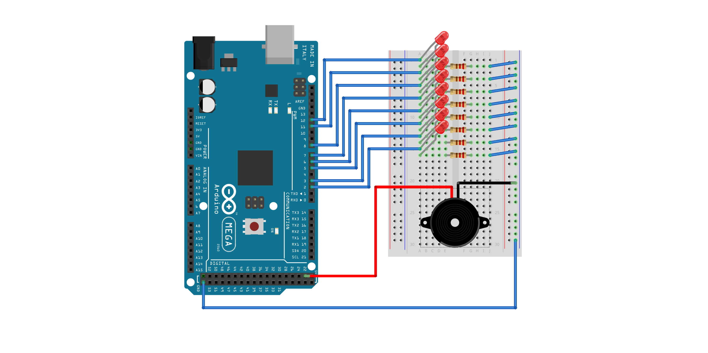



## What is 8bithouse?

**8bithouse** is the simplest way to realize a smart house engine for your home. It is coded in **C** and runs on an **Arduino Mega 2560** board. 
Through a simple shell you will be able to execute the basic commands which will allow you to interact with the board.

The first version accepts only eight devices, but it's easy to see that the code could be easily modified, allowing more wired pins. 
You could add and remove devices, enable them and dim them, adjusting the power.

## About us
We are two Computer Engineers, now graduating in the MSc of *Engineering in Computer Science* at *Sapienza University of Rome*. Visit our *LinkedIn* profiles to learn more about us.

- [Claudiu Ivan](https://www.linkedin.com/in/claudiu-gabriel-ivan-835a33176/)
- [Matteo Lombardi](https://www.linkedin.com/in/matteo-lombardi-065ab8183/)

## How to implement 8bithouse

It's not complex to carry out **8bithouse**, but you still need something to tune before you can start.

### Hardware

In order to implement this project you will need an **Arduino Mega 2560** board, a **breadboard**, **wires**, a **small buzzer**, **resistors** and some **leds** which will emulate the connected devices.
The configuration will be the one described above:

### Software

Arduino libraries are needed. You can install them executing `sudo apt-get install arduino`.

Make sure to have correct permission set on the serial port where you connect the board. 
If access is denied, you can change the permissions with this command: `sudo chmod a+rw /dev/ttyACM0`

### Compiling and running

* **Arduino**
	1. Connect the board to your pc
	2. Enter "arduino" folder
	3. Execute `make`
	4. Execute `make 8bh_avr.hex`
* **Client**
	1. Enter "client" folder
	2. Execute `make`
	3. Execute `./8bh` to run the client

### Commands

**8bithouse** allows six commands, here is a list with the techincal explaination of their functionalities:

* `8bh add <device-name>`: Searches for a hole in the bitmap of initialized devices. If the server finds a free space, it fills the hole with the new device. At first it is disabled.
* `8bh rm  <device-name>`: Searches for the name received and if found, the corresponding bitmap place is freed and the device erased.
* `8bh enable <device-name>`: If found, the device is enabled.
* `8bh disable <device-name>`: If found, the device is disabled.
* `8bh reset <device-name>`: Frees all registered devices in the board.
* `8bh dim <device-name>`: Searches for the name received and if found, brightness can be increased and decreased.